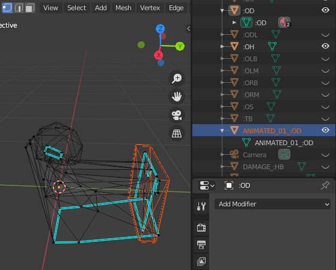

# Obj2Fce with _fcecodec_

The following files can be found in [_/scripts_](https://github.com/bfut/fcecodec/tree/main/scripts)

```
bfut_Obj2Fce3 (do not center parts, material to texpage).py
bfut_Obj2Fce3 (do not center parts, material to triagflag).py
bfut_Obj2Fce3 (material to texpage).py
bfut_Obj2Fce3 (material to triagflag).py
bfut_Obj2Fce4 (do not center parts, material to texpage).py
bfut_Obj2Fce4 (do not center parts, material to triagflag).py
bfut_Obj2Fce4 (material to texpage).py
bfut_Obj2Fce4 (material to triagflag).py
bfut_Obj2Fce4M (do not center parts, material to texpage).py
bfut_Obj2Fce4M (do not center parts, material to triagflag).py
bfut_Obj2Fce4M (material to texpage).py
bfut_Obj2Fce4M (material to triagflag).py
```

## Prerequisites

Install _fcecodec_ from https://github.com/bfut/fcecodec <br>
Install _tinyobjloader_ from https://github.com/tinyobjloader/tinyobjloader/tree/master/python <br>

## How to use

Run one of the script versions in a terminal

    python <bfut_Obj2Fce*.py> /path/to/input.obj

## Part name vs. part order

    <partname>

In FCE4 and FCE4M, only the part name defines a part's role (e.g., FCE4 high
body must be called `:HB`). Contrarily in FCE3, only the part order defines a
part's role and its name can be arbitrary (e.g., part index 0 is FCE3 high
body).

Of note in FCE3 is the optional hidden lights part, which always has index 12
(0-based index).

For a complete overview, see [_/src/fcelib/fcelib_fcetypes.h_](https://github.com/bfut/fcecodec/blob/main/src/fcelib/fcelib_fcetypes.h)

## Damage model (FCE4, FCE4M)

    <partname>
    DAMAGE_<partname>

Example: Once `:HB` high body is finished, create a copy named `DAMAGE_:HB` <br>
In this new part, only change vertice positions or vertice normals.

For a list of parts that use damage models, see [_/src/fcelib/fcelib_fcetypes.h_](https://github.com/bfut/fcecodec/blob/main/src/fcelib/fcelib_fcetypes.h)

## Part center

    <partname>
    POSITION_<partname>

A custom part center is highly desirable for `:OD` driver animation, where the
part center should typically be at the center of the steering wheel. Also useful
for `:OS` spoiler animation.

To define a custom part center, create a helper part `POSITION_<partname>`. The
helper part's centroid will be used as center in `<partname>`.

Default behavior is highly desirable for the following: wheels, front brakes,
driver head. If no helper part is present, for each part its centroid will be
used as part center.

The `do not center parts` scripts will leave the coordinate origin as center for
all parts (not recommended).

## Vertice animation flag (FCE4, FCE4M)

    <partname>
    ANIMATED_##_<partname>

For `:OD` driver animation, vertices are either movable or immovable. To set
movable verts, they have to be enclosed within at least one cuboid helper part
`ANIMATED_##_<partname>`, where # is a digit 0-9. See screenshot below.

Partnames must not be identical, hence the digits.

Default behavior if no helper part is found: all vertices for this part are
movable.

(FCE4) Vertice animation flags do not seem to have any effect on wheels, front
brakes, driver head, and movable spoiler.



## Dummies (Light / FX objects)

    DUMMY_##_<dummyname>

To create dummy `<dummyname>`, create a helper part called
`DUMMY_##_<dummyname>`, where # is a digit 0-9. The part centroid will be the
dummy position. Only the part name and its centroid are significant.

Partnames must not be identical, hence the digits. Dummynames can be identical.

For dummynames and their effects, see [_/src/fcelib/fcelib_fcetypes.h_](https://github.com/bfut/fcecodec/blob/main/src/fcelib/fcelib_fcetypes.h)

## Triangle flags

This functionality is offered in the `material to triagflag` scripts.

Internally, FCE triangle flags are positive integer values. Triangle flags
values and their effects are identical across FCE3, FCE, and FCE4M, in sofar
they are implemented. FCE generally allows to set any integer value, even if it
has no effect in-game.

The `Obj2Fce` converter scripts set triangle flags from tags in material names.

The order of the tags is not significant. A material name can include additional
elements that are not tags.

| Triangle flag         |           Tag |   Hex value | fce version |
|:----------------------|:--------------|------------:|:-----------:|
| default               |      \_FDEF\_ |       0x000 |         all |
| matte (no reflection) |      \_FMAT\_ |       0x001 |         all |
| high chrome           |      \_FHIC\_ |       0x002 |         all |
| no cull               |      \_FNOC\_ |       0x004 |         all |
| semi-transparent      |      \_FSET\_ |       0x008 |         all |
| ? (unknown 1)         |      \_FUN1\_ |       0x010 |           ? |
| all windows           |      \_FALW\_ |       0x020 | FCE4, FCE4M |
| front window          |      \_FFRW\_ |       0x040 | FCE4, FCE4M |
| left window           |      \_FLEW\_ |       0x080 | FCE4, FCE4M |
| back window           |      \_FBAW\_ |       0x100 | FCE4, FCE4M |
| right window          |      \_FRIW\_ |       0x200 | FCE4, FCE4M |
| broken window         |      \_FBRW\_ |       0x400 | FCE4, FCE4M |
| ? (unknown 2)         |      \_FUN2\_ |       0x800 |           ? |

Example: A non-broken window on the left side in FCE4/FCE4M may have triangle
flag `0x0AE`. This can be set by assigning the triangle to a material name that
includes `_FHIC_FNOC_FSET_FALW_FLEW_` (i.e., high chrome, no cull,
semi-transparent, all windows, left window).

## Texture page

This functionality is offered in the `material to texpage` scripts.

Like triangle flags, the triangles texture page is a positive integer
value. The `Obj2Fce` converter scripts looks for one tag in a material name.

The texture page and triangle flag tags can be combined each other.

A material name can include additional elements that are not tags.

| Texture page |  Tag       |   Hex value |
|:-------------|:---------- |------------:|
|            0 | (no tag)   |       0x000 |
|            1 | \_T1\_     |       0x001 |
|            2 | \_T2\_     |       0x002 |
|         <i\> | \_T\<i\>\_ |  hex(\<i\>) |

Example: To set texture page `0`, no tag is needed. For texture page `4`, add
tag `_T4_` to the material name.