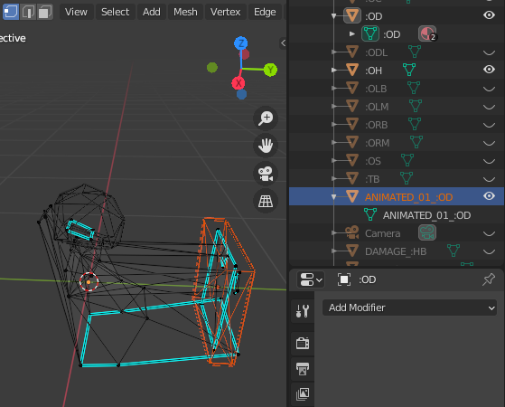

# Obj2Fce with fcecodec
This tutorial describes how to prepare OBJ/MTL files for the Obj2Fce converter
scripts. This tutorial covers FCE3, FCE4, and FCE4M.

The latest version of this tutorial can be found [here](https://github.com/bfut/fcecodec/tree/main/scripts/doc_Obj2Fce.md).<br/>
The following files can be found in [_/scripts_](https://github.com/bfut/fcecodec/tree/main/scripts)

```
bfut_Fce2Obj.py
bfut_Obj2Fce3 (material to triagflag).py
bfut_Obj2Fce3 (material to triagflag, material to texpage).py
bfut_Obj2Fce4 (material to triagflag).py
bfut_Obj2Fce4 (material to triagflag, material to texpage).py
bfut_Obj2Fce4M (material to triagflag).py
bfut_Obj2Fce4M (material to triagflag, material to texpage).py
bfut_Obj2Fce3 (do not center parts, material to triagflag).py
bfut_Obj2Fce3 (do not center parts, material to triagflag, material to texpage).py
bfut_Obj2Fce4 (do not center parts, material to triagflag).py
bfut_Obj2Fce4 (do not center parts, material to triagflag, material to texpage).py
bfut_Obj2Fce4M (do not center parts, material to triagflag).py
bfut_Obj2Fce4M (do not center parts, material to triagflag, material to texpage).py
```

## How to use
Run one of the script versions in a terminal

    python <bfut_Obj2Fce*.py> /path/to/model.obj

## Prerequisites
Install _fcecodec_ from https://github.com/bfut/fcecodec<br/>
Install _numpy_ from https://numpy.org/install<br/>
Install _tinyobjloader_ from https://github.com/tinyobjloader/tinyobjloader/tree/master/python

## Introduction
Create an OBJ example that showcases some of the herein discussed concepts, with

    python bfut_Fce2Obj.py /path/to/model.fce

FCE4 and FCE4M are very similar to each other. Certain differences are discussed
in this tutorial at this time.

`fcecodec` functions allow changing most FCE properties.

## Part name vs. part order

    <partname>

In FCE4 and FCE4M, only the part name defines a part's role (e.g., `:HB` is FCE4
high body).

In FCE3, only the part order defines a part's role and its name can
be arbitrary (e.g., part index 0 is FCE3 high body).<br/>
The optional hidden lights part in FCE always has part index 12.

For complete part name and part order listings, see [_/src/fcelib/fcelib_fcetypes.h_](https://github.com/bfut/fcecodec/blob/main/src/fcelib/fcelib_fcetypes.h)

## Damage model (FCE4, FCE4M)

    <partname>
    DAMAGE_<partname>

Example: Once `:HB` high body is finished, create a copy named `DAMAGE_:HB`.<br/>
In this new part, only change vertice positions or vertice normals.

For a list of parts that use damage models in-game, see [_/src/fcelib/fcelib_fcetypes.h_](https://github.com/bfut/fcecodec/blob/main/src/fcelib/fcelib_fcetypes.h)

## Part center

    <partname>
    POSITION_<partname>

A custom part center is highly desirable for driver animation
(`:OD`, `:PHdriver`), where the part center should be in the middle of the
steering wheel.
Also useful for `:OS` spoiler animation.

To define a custom part center, create a helper part `POSITION_<partname>`. The
helper part's centroid will be used as center in `<partname>`.

As default if no helper part is found, for each part its centroid will be used
as part center. Default behavior is highly desirable for the following: wheels,
front brakes, driver head.

The `do not center parts` scripts will leave the coordinate origin as center for
all parts (not recommended for FCE3, FCE4M).

## Vertice animation flag (FCE4, FCE4M)

    <partname>
    ANIMATED_##_<partname>

(FCE4) `:OD`<br/>
(FCE4M) `:PHdriver`

For driver animation, vertices are either movable or immovable.
To set movable verts, they have to be enclosed within at least one cuboid helper
part `ANIMATED_##_<partname>`, where # is a digit 0-9. See screenshot below.

Helper part names must not be duplicated, hence the digits.

Default behavior if no helper part is found: all vertices for this part are
movable.

Vertice animation flags do not seem to have any visible effect on any of the
other animated parts (wheels, front brakes, driver head, movable spoiler,
and everything `dash.fce`).



## Dummies (Light / FX objects)

    DUMMY_##_<dummyname>

To create dummy `<dummyname>`, create a helper part called
`DUMMY_##_<dummyname>`, where # is a digit 0-9. The part centroid will be the
dummy position. Only the part name and its centroid are significant.

Helper part names must not be duplicated, hence the digits. `<Dummynames>` can
be duplicated at will.

For dummynames and their effects, see [_/src/fcelib/fcelib_fcetypes.h_](https://github.com/bfut/fcecodec/blob/main/src/fcelib/fcelib_fcetypes.h)

## Triangle flags
Triangle flags can be assigned with the `material to triagflag` scripts.

In FCE, each triangle has a triangle flag, which is a positive integer value.
Triangle flags values and their effects are identical across FCE3, and FCE4, in
sofar they are implemented in-game. It is generally possible to set any integer
value, even if it has no effect in-game.

The `Obj2Fce` converter scripts set triangle flags from tags in material names.

The order of the tags is not significant. A material name can include additional
elements that are not tags.

| Triangle flag         |      Tag | Hex value | fce version |
|:----------------------|:---------|----------:|:-----------:|
| default               | \_FDEF\_ |     0x000 |         all |
| matte (no reflection) | \_FMAT\_ |     0x001 |         all |
| high chrome           | \_FHIC\_ |     0x002 |         all |
| no cull               | \_FNOC\_ |     0x004 |         all |
| semi-transparent      | \_FSET\_ |     0x008 |         all |
| ? (unknown 1)         | \_FUN1\_ |     0x010 |           ? |
| all windows           | \_FALW\_ |     0x020 |  FCE4/FCE4M |
| front window          | \_FFRW\_ |     0x040 |  FCE4/FCE4M |
| left window           | \_FLEW\_ |     0x080 |  FCE4/FCE4M |
| back window           | \_FBAW\_ |     0x100 |  FCE4/FCE4M |
| right window          | \_FRIW\_ |     0x200 |  FCE4/FCE4M |
| broken window         | \_FBRW\_ |     0x400 |  FCE4/FCE4M |
| ? (unknown 2)         | \_FUN2\_ |     0x800 |           ? |

Example: A non-broken window on the left side in FCE4 may have triangle
flag `0x0AE`. This can be set by assigning the triangle to a material name that
includes `_FHIC_FNOC_FSET_FALW_FLEW_` (i.e., high chrome, no cull,
semi-transparent, all windows, left window).

This paragraph can be skipped:
With the Obj2Fce scripts, it is also possible to use the raw hex value as
material name, i.e., `0x0AE`. However, the advantage of using triangle flag tags
is, that they can be combined with a texture page tag, see next section below.
Also, it avoids constantly dealing with mathematics.
Briefly, on the meaning behind the final hex value.
`0x0AE` is equal to `0x002 + 0x004 + 0x008 + 0x020 + 0x080` (use a calculator).
The visible in-game effect is the same when an integer that is greater or
equal than `0x1000` is added. For example, `0x0AE + 0xB3000` is equal to
`0xB30AE`, which again ticks the high chrome, no cull,
semi-transparent, all windows, left window triangle flags.
Hex value `0xB3000` should have the same visible in-game effect as `0x000`.

(FCE4M) The above values are identical. Additionally, FCE4M introduced damage
textures that are assigned using triangle flags, using new values combined with
using multiple texture pages.
The specifics are out of the scope of this tutorial at this time.

For more details, see [_/src/fcelib/fcelib_fcetypes.h_](https://github.com/bfut/fcecodec/blob/main/src/fcelib/fcelib_fcetypes.h)

## Texture page (FCE3/FCE4 officer models, FCE4 pursuit road objects, FCE4M damage textures)
Texture pages can be assigned with the `material to texpage` scripts.

Similarly to triangle flags, in FCE, each triangle is assigned a texture page,
which is a positive integer value.
The `Obj2Fce` converter scripts look for and use the first tag in a material
name that fits the below scheme.

A texture page tag and triangle flag tags can both be present in a material
name.
A material name can include additional elements that are not tags.

For officer models and pursuit road objects, the `NumArts` value must equal
the greatest used texture page minus 1. In all other cases, `NumArts = 1`.

Texture pages are not relevant for, `car.fce` (FCE3, FCE4) and `dash.fce`
(FCE4, FCE4M).

| Texture page |  Tag       |   Hex value |
|:-------------|:---------- |------------:|
|            0 | (no tag)   |       0x000 |
|            1 | \_T1\_     |       0x001 |
|            2 | \_T2\_     |       0x002 |
|         <i\> | \_T\<i\>\_ |  hex(\<i\>) |

Example: For texture page `0`, no tag is needed. For texture page `4`, add
tag `_T4_` to the material name.

## Information
__Obj2Fce License:__ zlib License<br/>
__Fce2Obj License:__ zlib License<br/>
__fcecodec License:__ GNU General Public License v3.0+<br/>
__Website:__ <https://github.com/bfut/fcecodec>